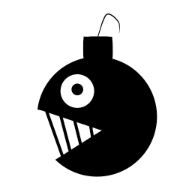

# マインスイーパー

(むじつくん)

## プレイはこちらから

https://ktshs-research-assignment-e2022.github.io/Minesweeper/

## あそびかた

- パソコン
    - マスを開く: 左クリック
    - 旗を立てる: 右クリック

- スマホ
    - マスを開く: タップ
    - 旗を立てる: 🚩ボタンで旗立てモードと切り替え
    
## 作ってみての感想も書きました

https://github.com/KTSHS-Research-Assignment-E2022/Impression-of-making-Minesweeper

## 使用しているフレームワーク

- Jetpack Compose for Web

## 使用している言語

- Kotlin
- HTML
- CSS
- JavaScript

## 使用してるフォント

- M PLUS 2 Variable Font
- M PLUS Rounded 1c
OFLライセンスの元で使用しています

## Special thanks

デザイン科 A.Kくん (アイコン書いてくれた)
